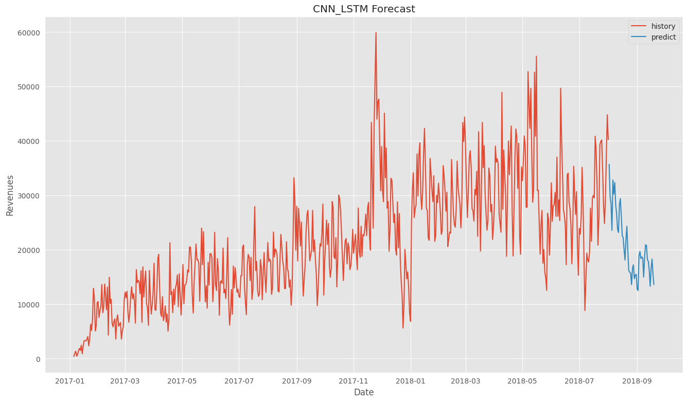

# Xây dựng và phân tích trên OLAP cube của sàn thương mại điện tử Olist
## 1. Giới thiệu

Đồ án này thực hiện xây dựng và phân tích trên OLAP cube của sàn thương mại điện tử Olist. Dữ liệu được sử dụng trong đồ án này là dữ liệu của Olist được công khai trên Kaggle, xem [tại đây](https://www.kaggle.com/datasets/olistbr/brazilian-ecommerce). 

Dữ liệu này bao gồm 10 bảng dữ liệu với các thông tin về khách hàng, đơn hàng, sản phẩm, vận chuyển, thanh toán, đánh giá, v.v. Và dữ liệu này sẽ được xây dựng thành một data warehouse dạng sao (star schema) với các bảng fact và các bảng dimension. 

## 2. Công cụ sử dụng

1. SQL Server Management Studio (SSMS) để tạo và quản lý cơ sở dữ liệu.

2. SQL Integration Services (SSIS) để xây dựng dữ liệu dạng sao (data warehouse).

3. SQL Server Analysis Services (SSAS) để xây dựng OLAP cube.

4. Power BI và Excel Pivot để phân tích dữ liệu trên OLAP cube.

## 2. Phân tích dữ liệu trên OLAP cube

Sau khi xây dựng OLAP cube, đồ án này sẽ trả lời các câu hỏi sau:

- Câu hỏi 1: Tổng doanh số bán hàng, phí vận chuyển trong tất cả các năm?

- Câu hỏi 2: 3 thành phố mà có doanh số bán hàng cao nhất trong năm 2017 và 2018?

- Câu hỏi 3: Số lượng sản phẩm bán được theo các quý trong các năm của bang SP?

- Câu hỏi 4: tổng doanh số bán hàng tại bang Sao Paulo (SP) theo từng tháng của năm 2017?

- Câu hỏi 5: Thông tin chi tiết đơn hàng bằng mã hóa đơn 0008288aa423d2a3f00fcb17cd7d8719?

- Câu hỏi 6: Tỉ lệ phí vận chuyển trên tổng tiền của đơn hàng theo thứ tự giảm dần?

- Câu hỏi 7: Với mỗi tiểu bang, đưa ra 3 thành phố có doanh thu bán hàng cao nhất?

- Câu hỏi 8: Thống kê top 3 loại sản phẩm có doanh số cao nhất của từng tháng của từng năm?

- Câu hỏi 9: Thống kê điểm đánh giá đơn hàng trung bình của từng tiểu bang trong năm 2017?

- Câu hỏi 10: Thống kê số lượng giao dịch bằng thẻ tín dụng (credit card) theo từng tháng của tiểu bang SP?

Các câu hỏi trên sẽ được trả lời bằng cách sử dụng câu truy ván MDX trên OLAP cube, song song với đó là sử dụng Power BI và Excel Pivot để vẽ biểu đồ biểu diễn câu hỏi.

## 3. Xây dựng mô hình machine learning dự đoán doanh bán hàng của Olist trong vòng 30 ngày tiếp theo

1. Kết quả dự đoán của mô hình SARIMA 

2. Kết quả dự đoán của mô hình Random Forest 

3. Kết quả dự đoán của mô hình CNN-LSTM 

## 4. Tài liệu tiếng Việt

Tài liệu chi tiết tiếng việc về đồ án có thể tải file pdf [tại đây](Nhóm_44_20520667_LuongNguyenThanhNhan_20520556_TrinhGiaHuy.pdf)

Video chi tiết về các quá trình xây dựng và phân tích dữ liệu trên OLAP cube có thể xem [tại đây](https://uithcm-my.sharepoint.com/:f:/g/personal/20520667_ms_uit_edu_vn/EmghZSKHwSBBpc8G0N5saocBu1Db_af1MAxiRkw2oYuR8w?e=uL3Ofi)